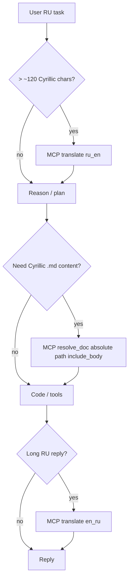

# Cloud Agents playbook

Cursor **Cloud Agents** do not run your local `~/.cursor/hooks.json`. That means:

- No lazy `Read` rewrite to EN cache
- No `user_prompt` / `agent_response` audit hooks
- No automatic RU→EN on Send

Use **MCP** (`translate`, `resolve_doc`) + a **warm EN doc cache** instead.

See also: [runtime-guide.md](./runtime-guide.md), [mcp-setup.md](./mcp-setup.md).

---

## What works in Cloud

| Capability | Mechanism |
|---|---|
| Read Cyrillic `.md` in English | MCP `resolve_doc` (`include_body: true`) or committed `.en.md` in repo |
| Long RU task instructions | MCP `translate` (`direction: ru_en`) before reasoning |
| RU reply to user | MCP `translate` (`direction: en_ru`) on user-facing prose |
| Metrics | MCP paths log to `~/.cursor/translate-proxy/metrics.jsonl` on the VM (if home persists) |

---

## One-time VM / dashboard setup

1. **Install** (same as local — see [mcp-setup.md](./mcp-setup.md)):

   ```bash
   npm install -g cursor-translate   # after publish; or clone + npm run build + init --path
   cursor-translate init --path
   ```

2. **Enable MCP** in Cursor Dashboard / agent MCP config:

   ```json
   {
     "mcpServers": {
       "cursor-translate": {
         "command": "cursor-translate-mcp"
       }
     }
   }
   ```

3. **Enable plugin rules** (recommended) — symlink or install `cursor-translate` plugin so `mcp-translate.mdc` loads.

4. **`agent` CLI logged in** on the VM (translate tier uses `agent --print --mode ask --model gpt-5.4-nano-none`).

5. **Reload MCP** after install or upgrade (`npm run build` in dev).

---

## Warm the EN doc cache

Pick **one** strategy (or combine).

### A. Global cache on the VM (recommended)

Run once per project when the cloud VM has network + `agent` CLI:

```bash
cd /path/to/repo
cursor-translate docs
# → ~/.cursor/translate-proxy/cache/<project-slug>/*.en.md
```

Pros: not in git, same cache as local if home dir is shared.  
Cons: lost if the VM is ephemeral and home is not persisted — re-run `docs` on each fresh VM.

### B. Commit EN cache in the repo

Copy selected files into the repo (e.g. `docs/en/` or `*.en.md` beside sources) **only if** your team accepts translated docs in version control.

Pros: Cloud Agent sees EN without MCP translate on every run.  
Cons: repo noise, merge churn, policy decision.

### C. On-demand only (no warmup)

Skip `docs`; first `resolve_doc` per file translates via nano (slower, costs translate tier).

Pros: zero prep.  
Cons: first read latency + translate cost per stale file.

---

## Agent workflow (every task)

Plugin rule `mcp-translate.mdc` encodes this; summary:



### `resolve_doc` checklist

- Pass **absolute** `file_path` (e.g. `/workspace/crypto3/ROADMAP.md`)
- Set `project_slug` to match cache dir (git repo folder name, e.g. `crypto3`)
- Use `include_body: true` when the agent should reason on doc text in one step
- Prefer `readPath` / `body` from the tool result — do not read the Russian source path

### `translate` checklist

- `ru_en` before heavy reasoning on long RU instructions
- `en_ru` before delivering long prose to a Russian-speaking user
- `force: true` only if breakeven skip blocked a needed translation
- Skip for code, paths, task IDs (`AUD-*`, `BL-*`)

---

## Cloud checklist (copy before each new cloud project)

- [ ] MCP `cursor-translate` enabled and shows `translate` + `resolve_doc`
- [ ] Plugin rules enabled (`mcp-translate.mdc`)
- [ ] `agent` CLI available and logged in on VM
- [ ] `cursor-translate docs` run OR EN docs committed OR accept on-demand cost
- [ ] `AGENTS.md` / `CURSOR.md` mentions: use MCP for RU prompts and Cyrillic docs
- [ ] Smoke: `npm run verify:mcp` (from dev repo) or manual MCP call in agent chat

---

## Verify on the VM

```bash
# Binaries
which cursor-translate cursor-translate-mcp

# Cache warmup (dry run)
cd /path/to/repo && cursor-translate docs --dry-run

# Resolve smoke (cache hit after warmup)
cursor-translate resolve ROADMAP.md --json

# From dev clone — full smoke script
npm run verify:mcp
```

In agent chat: ask a long RU question about architecture; confirm MCP `translate` + `resolve_doc` appear in tool trace.

---

## Limits (unchanged)

| Gap | Workaround |
|---|---|
| IDE hooks in Cloud | MCP only |
| Auto-translate Send in UI | MCP `translate` at start of turn |
| Auto back-translate reply in UI | MCP `en_ru` before final message |
| Ephemeral VM without home | Re-run `docs` or commit EN cache |

If Cursor adds cloud hook support or `updated_prompt` on `beforeSubmitPrompt`, revisit [runtime-guide.md](./runtime-guide.md).
